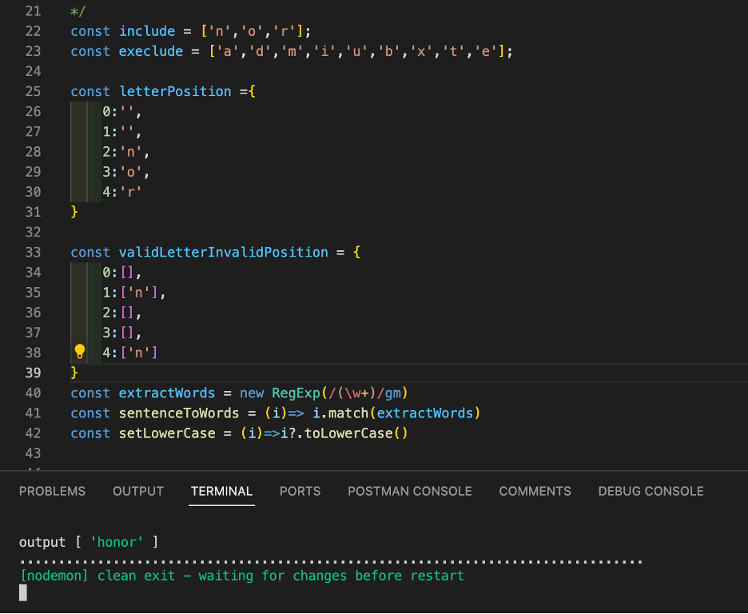

This whole project started as a joke, when my co-workers were playing [wordle](https://www.nytimes.com/games/wordle/index.html) during the work break, and I decided to use my tech skills to help me with winning this game. I didn't put much effort into cleaning up the code, or making it into an app or web-page/package. just the basics to get it working locally.

To run this project, I simply recommend using the following command, with vs-code.

```
npx nodemon index.js
```

you'll have to keep making changes in the file, nodemon will be in charge of updating the list of recommendation in your terminal.


I've commented out the main parts of the code that I need to re-use and replace after finishing the game, for quick reference.

```js
const include = [];     // letters to include
const execlude = [];    // to exclude from the word

const letterPosition ={ // Position for correct letter 
    0:'',
    1:'',
    2:'',
    3:'',
    4:''
}

// A letter that's valid in th word, but is not valid in this position.
const validLetterInvalidPosition = {
    0:[],
    1:[],
    2:[],
    3:[],
    4:[]
}
```

I used [wordlegame](https://wordlegame.org/) while working on this script, and it seems to be working fine almost everytime. Enjoy.


Check the example below


```js
const include = ['n'];
const execlude = ['a','d','m','i'];

const letterPosition ={
    0:'',
    1:'',
    2:'',
    3:'',
    4:''
}

const validLetterInvalidPosition = {
    0:[],
    1:[],
    2:[],
    3:[],
    4:['n']
}
```
---

----





